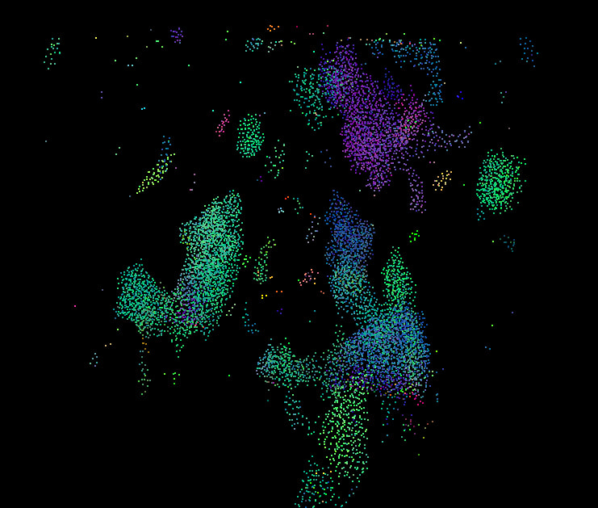
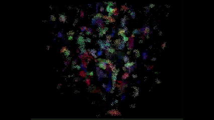
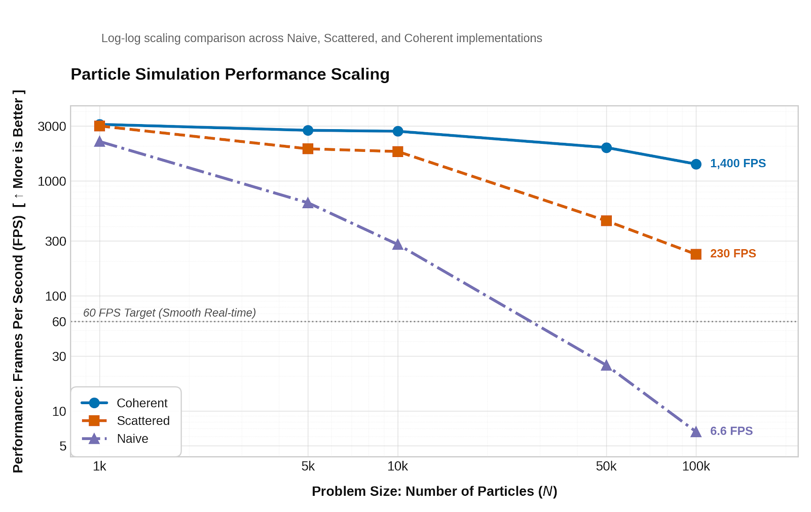
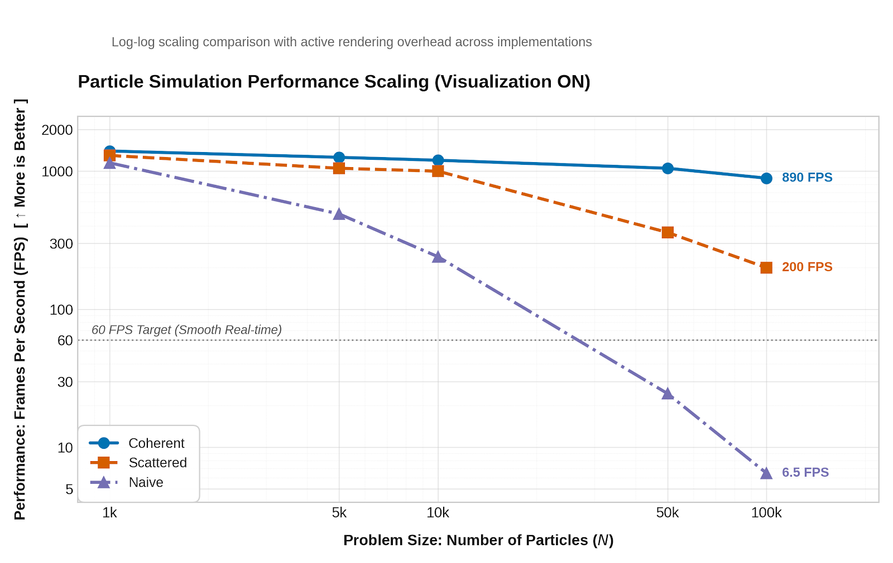
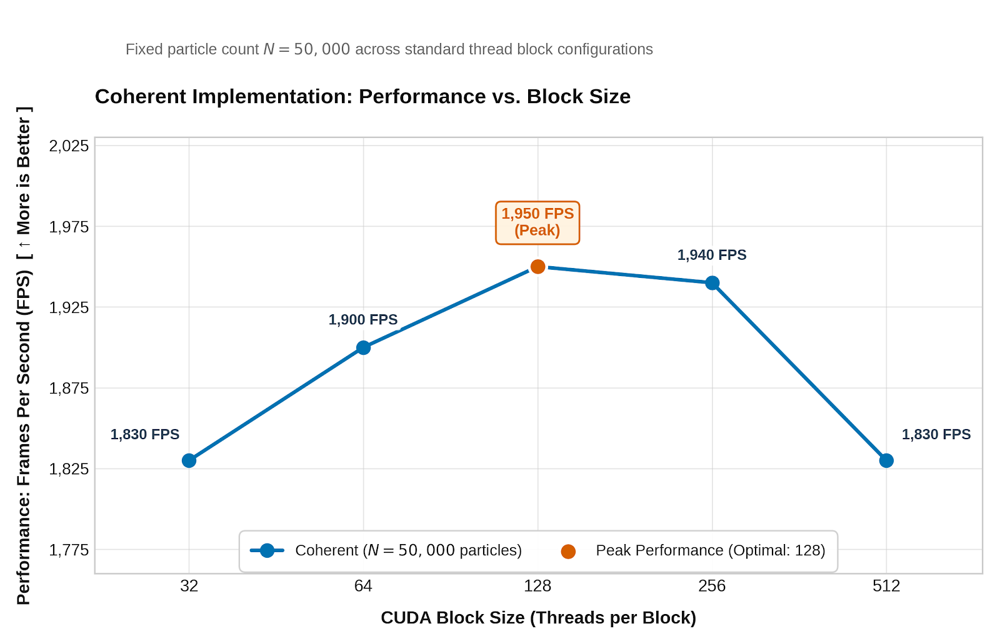
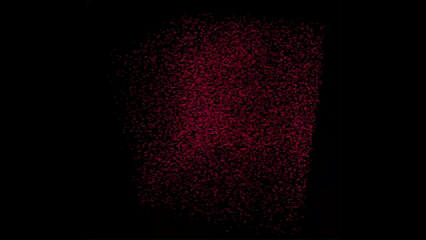

**University of Pennsylvania, CIS 5650: GPU Programming and Architecture, Project 1 - Flocking**

- Nikita Lopatenko
- Tested on: Windows 11 Pro, 13th Gen Intel Core i7-13620H, 32GB RAM, NVIDIA GeForce RTX 4070 Laptop GPU (8GB), CUDA 13.1, CMake + Ninja (Release)

### Overview

Boids on the GPU, three ways of neighbor scanning:

1. **Naive** — every bird checks every other bird (classic N² vibes)
2. **Scattered uniform grid** — only nearby cells, but `pos`/`vel` are randomly spread
3. **Coherent uniform grid** — same grid idea, plus reshuffling so birds in one cell are next to each other in memory

### Build notes (`CMakeLists.txt`)

On Windows I had small CMake tweaks so CUDA headers resolve and the GPU architecture matches this laptop:

- ensure `CMAKE_CUDA_TOOLKIT_INCLUDE_DIRECTORIES` is on the include path (Windows branch)
- set `CUDA_ARCHITECTURES` to `89` (RTX 4070 Laptop / sm_89)

Built with **Ninja + Release** (VS generator was painful earlier; Ninja worked).

---

## Performance analysis

- Build: **Release** (`build_ninja`)
- **VSync Off** in NVIDIA Control Panel
- Metric: FPS from the window title
- Default `blockSize = 128`
- Modes changed between  `UNIFORM_GRID` / `COHERENT_GRID` / `VISUALIZE` in `main.cpp`

### FPS vs number of boids (visualization OFF)

| N       | Naive | Scattered | Coherent |
| ------- | ----- | --------- | -------- |
| 1,000   | 2200  | 3000      | 3100     |
| 5,000   | 645   | 1900      | 2750     |
| 10,000  | 280   | 1800      | 2700     |
| 50,000  | 25    | 450       | 1950     |
| 100,000 | 6.6   | 230       | 1400     |

### FPS vs number of boids (visualization ON)

With visualization ON, everything gets slower (rendering is not free), but the **ranking stays the same**:
Coherent > Scattered > Naive at large N.

### FPS vs block size (Coherent, N = 50,000, visualization OFF)

| blockSize | FPS             |
| --------- | --------------- |
| 32        | 1830            |
| 64        | 1900            |
| 128       | **1950** (best) |
| 256       | 1940            |
| 512       | 1830            |

---

## Answers to the Part 3 questions

**1. How does changing the number of boids affect performance?**

For each implementation the more boids I had the lower was FPS. This is due to the fact that more birds simply means more work per frame. Naive is affected the most because its computational logic is, well, naive (pun intended): each bird checks EVERY other bird. For Scattered it is not as bad because it is more skeptical in picking other particles that may affect current one. Finally the Coherent has the most sophisticated approach where we also consider memory access issues.

**2. How does changing block size affect performance?**

I checked block size on a Coherent setup with N = 50000 and saw that the best FPS is achieved at 128-256 block size. 32 or 512 are slightly worse, but not critically. This is because ~128 is an optimal size while 32 causes scheduling overhead and 512 makes GPU less flexibly occupied.

**3. Did coherent beat scattered?**

Coherent was better than Scattered, especially on a larger particle count, like 50k and 100k. At that scale, some time that we spend to arrange data finally pays off. Accessing position and velocity in random places becomes very inefficient compared to a continuous memory belt.

**4. Cell width 2× vs 1× (neighborhood distance)?**

Changing cell width from 2 to 1 slightly decreased performance from 1950 to 1600 FPS. Now the same number of birds is spread through more cells. Because of this now we need to have more jumps in memory compared to a previous setup. Basically if before that we could read one long belt of data about birds, now they are all in different cells and therefore there are more "start...end" belts we need to scan. Difference in this memory access pattern is seen better at higher N: around 50-100k.

---

## Features completed

- Naive boids (Part 1)
- Scattered uniform grid + Thrust sort (Part 2.1)
- Coherent reshuffle of `pos`/`vel` (Part 2.3)
- Performance sweeps + write-up (Parts 3–4)

### Blooper corner (sign typo edition)

I accidentally flipped the sign on Rule 1 in the velocity update and instead of coming toward the local center of mass, every boid runs away from it. Separation still works, so they do not collapse into a sphere, they just do not flock. It looks like a near-uniform gas of particles filling the simulation cube with almost no clusters. It reminded me of a lazy CFD / particle-in-a-box vibe. 10/10 blooper!

